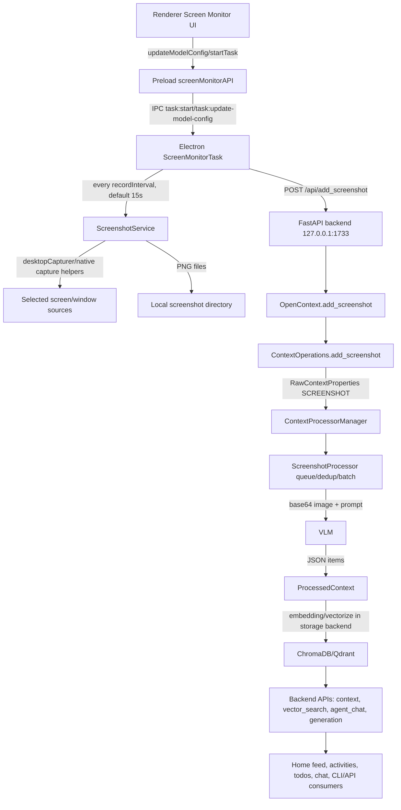

# MineContext source capture pipeline research

## 目标与来源

本文基于 Linear 源上下文 AIC-2473 的调研要求，为 AIC-2497 输出可复用的源码级研究记录。范围仅限源码与已有文档阅读；未修改运行时代码，未启动桌面录制，未采集截图，未读取或打印密钥。

核心结论：

- MineContext 桌面应用主链路主要依赖视觉截图：Electron 枚举屏幕/窗口源、周期性保存 PNG，再通过 1733 后端交给 VLM 抽取结构化上下文。
- UI 主链路默认采集频率是 15 秒，来自 `frontend/src/renderer/src/store/setting.ts` 的 `defaultScreenSettings.recordInterval`；启动前由 `frontend/src/renderer/src/pages/screen-monitor/screen-monitor.tsx` 通过 `screenMonitorAPI.updateModelConfig()` 写入 `ScreenMonitorTask.updateInterval(recordInterval * 1000)`。
- `config/config.yaml` 中 `capture.screenshot.capture_interval: 5` 属于 Python `ScreenshotCapture` 抽象采集组件配置，但该配置默认 `enabled: false`，不是当前 Electron 桌面录制主路径。
- 录制启动/停止由 Electron preload 暴露的 `screenMonitorAPI.startTask()` / `stopTask()` 触发，对应 IPC `task:start` / `task:stop` 和 `frontend/src/main/background/task/screen-monitor-task.ts` 的 `ScreenMonitorTask.startTask()` / `stopTask()`。
- 1733 是 OpenContext FastAPI 后端端口默认值；仓库内未发现 1734 Electron control API 或 `cli-anything-minecontext` 的源码实现，说明这部分若存在，应属于外部封装或本地运行产物，不是 MineContext 仓库内的原生控制面。

## 关键源码路径

| 领域 | 路径 | 关键类/函数 |
| --- | --- | --- |
| 桌面采集调度 | `frontend/src/main/background/task/screen-monitor-task.ts` | `ScreenMonitorTask`, `startTask`, `stopTask`, `startScreenMonitor`, `handleScreenshotTask`, `uploadImage`, `checkCanRecord` |
| 调度基类 | `frontend/src/main/background/task/schedule-next-task.ts` | `ScheduleNextTask.scheduleNextTask`, `updateInterval`, `stopScheduleNextTask` |
| Electron 截图服务 | `frontend/src/main/services/ScreenshotService.ts` | `checkPermissions`, `openPrefs`, `takeScreenshot`, `getVisibleSources`, `getCaptureAllSources`, `cleanupOldScreenshots` |
| 采集源枚举 | `frontend/src/main/utils/get-capture-sources.ts` | `CaptureSourcesTools`, `getCaptureSourcesTools`, `getVisibleSourcesTools`, `takeSourceScreenshotTools` |
| Electron preload API | `frontend/src/preload/index.ts` | `screenMonitorAPI` |
| IPC 常量 | `frontend/packages/shared/IpcChannel.ts` | `Screen_Monitor_*`, `Task_Start`, `Task_Stop`, `Task_Update_Model_Config` |
| 前端启动/设置 | `frontend/src/renderer/src/pages/screen-monitor/screen-monitor.tsx` | `startMonitoring`, `stopMonitoring`, `handleSave`, `updateCurrentRecordApp` |
| 前端默认设置 | `frontend/src/renderer/src/store/setting.ts` | `defaultScreenSettings` |
| 后端入口 | `opencontext/cli.py` | `opencontext start`, `--port`, `handle_start`, `start_web_server` |
| 后端路由聚合 | `opencontext/server/api.py` | `router.include_router(...)` |
| 截图 API | `opencontext/server/routes/screenshots.py` | `POST /api/add_screenshot`, `POST /api/add_screenshots` |
| OpenContext 编排 | `opencontext/server/opencontext.py` | `OpenContext.initialize`, `start_capture`, `add_screenshot`, `_handle_captured_context` |
| 上下文操作 | `opencontext/server/context_operations.py` | `add_screenshot`, `search` |
| 处理路由 | `opencontext/managers/processor_manager.py` | `ContextProcessorManager._define_routing`, `process` |
| 截图处理 | `opencontext/context_processing/processor/screenshot_processor.py` | `ScreenshotProcessor`, `_run_processing_loop`, `_process_vlm_single`, `batch_process` |
| VLM 客户端 | `opencontext/llm/global_vlm_client.py` | `GlobalVLMClient`, `generate_with_messages_async`, `generate_for_agent_async` |
| embedding 客户端 | `opencontext/llm/global_embedding_client.py` | `GlobalEmbeddingClient`, `do_embedding`, `do_vectorize_async` |
| 存储 | `opencontext/storage/unified_storage.py` | `UnifiedStorage.batch_upsert_processed_context`, `search` |
| Context Agent | `opencontext/context_consumption/context_agent/agent.py` | `ContextAgent.process`, `process_stream`, `process_query` |
| 文档配置 | `config/config.yaml`, `README.md` | 1733 后端、VLM/embedding、Python capture 配置 |

## 桌面采集入口

桌面应用的采集入口在 Electron 主进程，而不是 Python 后端主动抓屏。

1. `frontend/src/main/index.ts` 在 app ready 后创建 `const task = new ScreenMonitorTask()`，并启动后端进程、注册 IPC 和 power watcher。
2. `frontend/src/preload/index.ts` 将 `screenMonitorAPI` 暴露给 renderer，包含权限检查、源枚举、截图读写、设置保存、录制状态、`startTask` 和 `stopTask`。
3. `frontend/src/renderer/src/pages/screen-monitor/screen-monitor.tsx` 的 `startMonitoring()` 先调用 `updateModelConfig({ recordInterval, recordingHours, enableRecordingHours, applyToDays })`，再调用 `startTask()`。
4. `ScreenMonitorTask.listenToScreenMonitorEvents()` 注册 IPC handler。收到 `Task_Start` 时设置 `ScreenMonitorTask.globalStatus = 'running'` 并调用 `startTask()`；收到 `Task_Stop` 时设置为 `stopped` 并调用 `stopTask()`。
5. 采集源来自用户在 Screen Monitor 设置中选择的屏幕和窗口。`handleSave()` 会持久化 `settings.screenList/windowList`，并调用 `updateCurrentRecordApp()` 更新 `ScreenMonitorTask.appInfo`。

系统权限边界主要在 `ScreenshotService.checkPermissions()`：macOS 通过 `systemPreferences.getMediaAccessStatus('screen')` 检查屏幕录制权限；`openPrefs()` 打开 macOS 隐私设置。Windows/Linux 当前返回 true。

## 采集频率、调度、启动停止

### UI 主链路采集频率

- 默认值：15 秒，定义在 `frontend/src/renderer/src/store/setting.ts` 的 `defaultScreenSettings.recordInterval: 15`。
- 配置方式：Screen Monitor 页面状态通过 `use-setting`/Redux 管理，启动录制时 `startMonitoring()` 将 `recordInterval` 传给 `screenMonitorAPI.updateModelConfig()`。
- 生效位置：`ScreenMonitorTask` 收到 `Task_Update_Model_Config` 后执行 `this.updateInterval(config.recordInterval * 1000)`。
- 调度实现：`ScheduleNextTask.scheduleNextTask(true, this.startScreenMonitor.bind(this))` 立即执行一次，然后按 `POLLING_INTERVAL_MS - executionTime` 计算下一次延迟，减少运行耗时造成的漂移。

### Python capture 配置的 5 秒不是主路径

`config/config.yaml` 存在：

- `capture.screenshot.enabled: false`
- `capture.screenshot.capture_interval: 5`
- `capture.screenshot.storage_path: ${CONTEXT_PATH:.}/screenshots`

对应实现是 `opencontext/context_capture/screenshot.py` 的 `ScreenshotCapture`，使用 `mss` 截屏并可保存到本地目录。但默认禁用，且 Electron 录制主链路并不通过该组件周期抓屏，而是由 Electron `ScreenMonitorTask` 保存截图后 POST 到后端。

### 启动、停止、暂停恢复

- 启动：renderer `startMonitoring()` -> preload `screenMonitorAPI.startTask()` -> IPC `task:start` -> `ScreenMonitorTask.startTask()`。
- 停止：renderer `stopMonitoring()` -> preload `screenMonitorAPI.stopTask()` -> IPC `task:stop` -> `ScreenMonitorTask.stopTask()`。
- 睡眠/锁屏：`ScreenMonitorTask` 注册 `powerWatcher` 回调，系统 suspend 或 lock-screen 会 `stopTask()`；resume 或 unlock-screen 时，如果 `globalStatus` 仍为 `running`，则自动 `startTask()`。
- 录制时段：`ScreenMonitorTask.checkCanRecord()` 根据 `enableRecordingHours`、`applyToDays`、`recordingHours` 控制是否实际采集。
- 并发与节流：`screen-monitor-task.ts` 使用 `PQueue({ concurrency: 3 })` 限制同批截图上传并发；`AutoRefreshCache` 每 3 秒刷新可见源列表。
- 错误行为：`startScreenMonitor()` 外层捕获异常后会 `stopTask()`；单张截图上传失败只记录错误，不会直接抛出到调度循环。

## 数据流

本地截图落点：

- 打包应用：`app.getPath('userData')/Data/screenshot/activity/YYYY-MM-DD/HH-mm-ss/*.png`，见 `ScreenshotService.takeScreenshot()`。
- 开发模式：`process.cwd()/backend/screenshot/activity/YYYY-MM-DD/HH-mm-ss/*.png`。
- README 声明默认数据目录为 `~/Library/Application Support/MineContext/Data`。
- 截图清理：`frontend/src/main/index.ts` 启动每日清理任务，`ScreenshotService.cleanupOldScreenshots(15)` 删除 15 天前截图目录。

后端接收与处理：

- Electron `ScreenMonitorTask.uploadImage()` 将 `{ path, window, create_time, app }` POST 到 `http://127.0.0.1:${getBackendPort()}/api/add_screenshot`。
- `opencontext/server/routes/screenshots.py` 的 `add_screenshot()` 调用 `opencontext.add_screenshot(...)`。
- `ContextOperations.add_screenshot()` 校验路径存在，构造 `RawContextProperties(source=SCREENSHOT, content_format=IMAGE, content_path=path, additional_info={...})`，再回调 `OpenContext.add_context()`。
- `ContextProcessorManager._define_routing()` 将 `ContextSource.SCREENSHOT` 路由到 `screenshot_processor`。
- `ScreenshotProcessor.process()` 先 resize、pHash 去重，再进入队列；后台 `_run_processing_loop()` 满足 batch 条件后调用 `batch_process()`。

## VLM、embedding 与 context-agent 调用链

### VLM

截图理解在 `opencontext/context_processing/processor/screenshot_processor.py`：

- `_process_vlm_single()` 从 prompt 配置读取 `processing.extraction.screenshot_analyze`。
- 将截图文件编码为 base64，并以 `image_url: data:image/png;base64,...` 加入 user message。
- 调用 `opencontext.llm.global_vlm_client.generate_with_messages_async(messages)`。
- `GlobalVLMClient` 使用 `config/config.yaml` 的 `vlm_model` 初始化 `LLMClient(LLMType.CHAT)`，兼容 OpenAI API 协议。
- VLM 返回 JSON 后经 `parse_json_from_response()` 解析为 items，并转换为 `ProcessedContext`。

结论：截图语义提取依赖视觉模型，而不是 OCR 专用库。仓库也采集窗口/应用源 ID、source name、类型、可见性等元数据，但核心上下文理解来自视觉截图。

### embedding

embedding 在检索和存储链路中使用：

- `GlobalEmbeddingClient` 从 `embedding_model` 配置初始化 `LLMClient(LLMType.EMBEDDING)`，默认输出维度配置为 2048。
- `ContextOperations.search()` 将用户 query 包装为 `Vectorize(text=query)` 后调用 `UnifiedStorage.search()`。
- `UnifiedStorage` 的 vector backend 包含 ChromaDB 和 Qdrant 两种实现；配置默认 `chromadb`，路径 `${CONTEXT_PATH:.}/persist/chromadb`。
- `ScreenshotProcessor` 导入并使用 `do_vectorize_async`，生成的 `ProcessedContext` 最终通过 `get_storage().batch_upsert_processed_context(processed_contexts)` 写入向量后端。

### context agent

用户消费侧的 agent 在 `opencontext/context_consumption/context_agent/agent.py`：

- `ContextAgent.process()` 调用 `WorkflowEngine.execute()`。
- `process_stream()` 提供流式事件。
- 相关 FastAPI 路由在 `opencontext/server/routes/agent_chat.py`、`conversation.py`、`messages.py` 中注册。
- agent 工具链会使用 retrieval tools，例如 `opencontext/tools/retrieval_tools/semantic_context_tool.py`、`activity_context_tool.py` 等，从存储中检索上下文。
- `GlobalVLMClient.generate_for_agent_async()` 为 agent 返回原始 tool-call 响应，区别于截图处理中的自动工具执行模式。

## 存储与隐私边界

本地优先边界：

- README 明确默认本地数据目录是 `~/Library/Application Support/MineContext/Data`。
- 截图文件保存在本地 Data 或开发目录下，15 天清理策略由 Electron 每日任务执行。
- 结构化上下文和向量默认进入本地 ChromaDB：`config/config.yaml` 的 `${CONTEXT_PATH:.}/persist/chromadb`。
- 文档型存储默认 SQLite：`${CONTEXT_PATH:.}/persist/sqlite/app.db`。
- 日志默认 `${CONTEXT_PATH:.}/logs/opencontext.log`；Electron 后端启动日志写入 `app.getPath('userData')/debug/backend-*.log`。

会上云或离开本机的数据：

- 若配置的 `vlm_model.base_url` / `embedding_model.base_url` 指向云服务，截图 base64、提示词、抽取文本和 embedding 请求会发送到相应模型服务。
- 若使用本地 OpenAI-compatible 服务，则模型请求可保持在本地。
- API 鉴权默认 `api_auth.enabled: false`，1733 绑定 `127.0.0.1`。本地回环降低暴露面，但 agent 控制面集成仍应显式启用鉴权或进程级 ACL。

隐私风险：

- 截图是高敏感原始数据，且默认包含用户选择的整个屏幕或窗口。
- Electron 保存截图后再将本地路径传给后端；后端校验路径存在但没有更严格的路径白名单。
- `screenMonitorAPI.readImageAsBase64(filePath)` 可读取任意传入路径对应图片，控制面外放时必须加边界。
- 1733 后端若被代理或绑定非本地地址，默认无鉴权会扩大风险。

## API、Electron control API 与 CLI-Anything 控制面

### 1733 backend API

默认后端端口：

- `config/config.yaml`：`web.port: 1733`。
- `opencontext/cli.py`：`opencontext start --port 1733` 可覆盖端口。
- `frontend/src/main/backend.ts`：Electron 从 1733 开始寻找可用端口，并通过 `getBackendPort()` 供 `ScreenMonitorTask.uploadImage()` 使用。

关键 API：

- `POST /api/add_screenshot`：添加单张截图路径进入处理管线。
- `POST /api/add_screenshots`：批量添加截图。
- `POST /api/vector_search`：直接向量检索。
- `GET /api/context_types`：列出上下文类型。
- `POST /contexts/detail`、`POST /contexts/delete`：上下文详情和删除。
- settings、monitoring、agent_chat、content_generation、documents、vaults 等路由在 `opencontext/server/api.py` 聚合注册。

### Electron preload/control API

仓库内可确认的 Electron 控制面是 preload 暴露到 renderer 的 `window.screenMonitorAPI`，不是 HTTP 1734：

- 权限：`checkPermissions`, `openPrefs`
- 源枚举：`getVisibleSources`, `getCaptureAllSources`
- 截图操作：`takeScreenshot`, `deleteScreenshot`, `readImageAsBase64`, `getScreenshotsByDate`
- 设置：`getSettings`, `setSettings`, `clearSettings`
- 录制状态：`getRecordingStats`, `checkCanRecord`
- 调度控制：`updateModelConfig`, `startTask`, `stopTask`, `updateCurrentRecordApp`

仓库搜索未发现监听 1734 的 Electron HTTP control API。唯一 Express 服务是 `frontend/src/main/services/ExpressService.ts`，固定端口 3001，提供 `/api/chat` 示例式接口，且未在主进程中发现启用调用。

### CLI-Anything 控制面

MineContext 原生 CLI 只有 `opencontext start`，参数包括 `--config`、`--host`、`--port`、`--workers`。仓库内未发现 `cli-anything-minecontext` 源码或命令定义。

因此，当前控制面缺口是：

- 原生 CLI 不能 start/stop Electron `ScreenMonitorTask`。
- 1733 后端不能直接选择屏幕/窗口源，也不能控制 Electron 桌面截图调度。
- 1734 Electron control API 若为外部封装，需要在该封装中补齐鉴权、状态查询、幂等 start/stop、源选择和录制频率配置。

## 风险

- 视觉主链路成本高：每批截图都会进入 VLM，频率和选择源数量直接影响 token/费用/延迟。
- 默认 15 秒适合个人使用，但 agent 后台长期运行需要限流、时间窗和活动检测，否则容易产生无效截图。
- `ScreenMonitorTask.startScreenMonitor()` 遇到顶层异常会停止任务，agent 控制面需要健康检查和恢复策略。
- `PQueue` 并发为 3，但没有显式 backpressure 指标暴露给外部控制面。
- 1733 默认无鉴权，适合本地开发，不适合开放给远程 agent 或生产网络。
- macOS 权限需要 UI 授权和应用重启；无 UI 后台运行必须预先完成权限授予。
- Python `ScreenshotCapture` 与 Electron `ScreenMonitorTask` 是两条采集路径，配置项容易混淆。
- 存储路径依赖 `CONTEXT_PATH`、Electron userData 和开发/打包模式，外部运维需要统一数据目录解析。

## 面向 OpenClaw/agent 控制面的工程建议

1. 将 Electron `screenMonitorAPI` 能力封装为受控 HTTP/IPC control API，至少提供 `status`、`start`、`stop`、`configure`、`sources`、`select_sources`、`health`。
2. 1734 若继续作为 Electron control API 端口，应在 MineContext 仓库内落地源码和文档，避免外部 wrapper 与主进程真实状态漂移。
3. start/stop 设计为幂等：重复 start 返回当前 running 状态，重复 stop 返回 stopped；暴露 `globalStatus`、`status`、下一次调度时间、queue size、最近错误。
4. 源选择必须使用白名单对象，而不是任意文件路径；对 `readImageAsBase64`、`deleteScreenshot` 增加 Data 目录约束。
5. 频率配置应统一命名：区分 Electron UI `recordInterval` 与 Python capture `capture_interval`，并在控制 API 返回当前实际生效频率。
6. 为 agent 增加“低频观察模式”：默认 60-300 秒，必要时临时提升到 15 秒，避免长期高频 VLM 消耗。
7. 后端 1733 对 agent 暴露时启用 `api_auth.enabled`，或只允许本机 Unix socket/loopback 加 token。
8. 采集链路增加 dry-run/status-only 命令：验证权限、源可见性、后端健康、模型配置、存储写入状态，但不实际截图。
9. 将截图处理指标通过 API 暴露：processed/failed、队列长度、最近 VLM 错误、最近 embedding 错误、存储后端状态。
10. 对 AIC-2396 的 CLI-anything 封装，建议只包装稳定控制面，不直接模拟 renderer 点击；缺失能力优先补 Electron control API 或 1733 后端 API。

## 验证关注点

本文档包含验收关键词：ScreenMonitorTask、1733、1734、VLM、embedding、Mermaid、数据流、采集频率、隐私、control API。